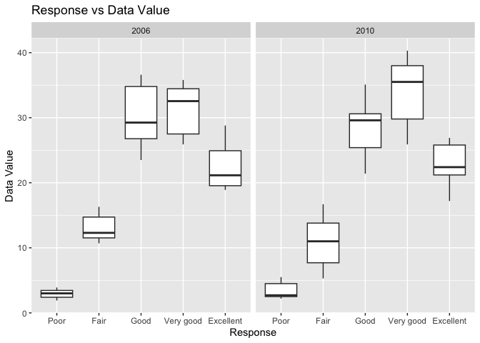
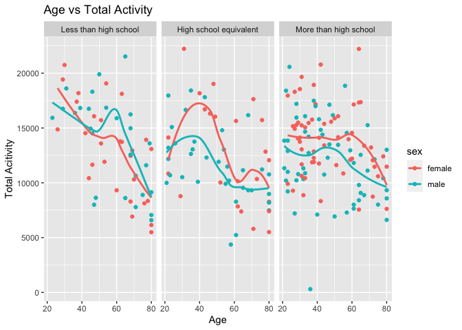

p8105_hw3_sc5352
================
Chrissy Chen
2023-10-14

### Problem 2

``` r
library(p8105.datasets)
library(tidyverse)
```

    ## ── Attaching core tidyverse packages ──────────────────────── tidyverse 2.0.0 ──
    ## ✔ dplyr     1.1.3     ✔ readr     2.1.4
    ## ✔ forcats   1.0.0     ✔ stringr   1.5.0
    ## ✔ ggplot2   3.4.3     ✔ tibble    3.2.1
    ## ✔ lubridate 1.9.2     ✔ tidyr     1.3.0
    ## ✔ purrr     1.0.2     
    ## ── Conflicts ────────────────────────────────────────── tidyverse_conflicts() ──
    ## ✖ dplyr::filter() masks stats::filter()
    ## ✖ dplyr::lag()    masks stats::lag()
    ## ℹ Use the conflicted package (<http://conflicted.r-lib.org/>) to force all conflicts to become errors

``` r
library(dplyr)
library(ggplot2)
data("brfss_smart2010")
brfss_smart = 
  brfss_smart2010 |>
  janitor::clean_names() |>
  rename(state = locationabbr, state_location = locationdesc) |>
  filter(topic == "Overall Health",
         response %in% c("Poor", "Fair", "Good", "Very good", "Excellent")) |>
  mutate(
    response = factor(response, 
         levels = c("Poor", "Fair", "Good", "Very good", "Excellent"),
         ordered = TRUE))
brfss_smart
```

    ## # A tibble: 10,625 × 23
    ##     year state state_location        class   topic question response sample_size
    ##    <int> <chr> <chr>                 <chr>   <chr> <chr>    <ord>          <int>
    ##  1  2010 AL    AL - Jefferson County Health… Over… How is … Excelle…          94
    ##  2  2010 AL    AL - Jefferson County Health… Over… How is … Very go…         148
    ##  3  2010 AL    AL - Jefferson County Health… Over… How is … Good             208
    ##  4  2010 AL    AL - Jefferson County Health… Over… How is … Fair             107
    ##  5  2010 AL    AL - Jefferson County Health… Over… How is … Poor              45
    ##  6  2010 AL    AL - Mobile County    Health… Over… How is … Excelle…          91
    ##  7  2010 AL    AL - Mobile County    Health… Over… How is … Very go…         177
    ##  8  2010 AL    AL - Mobile County    Health… Over… How is … Good             224
    ##  9  2010 AL    AL - Mobile County    Health… Over… How is … Fair             120
    ## 10  2010 AL    AL - Mobile County    Health… Over… How is … Poor              66
    ## # ℹ 10,615 more rows
    ## # ℹ 15 more variables: data_value <dbl>, confidence_limit_low <dbl>,
    ## #   confidence_limit_high <dbl>, display_order <int>, data_value_unit <chr>,
    ## #   data_value_type <chr>, data_value_footnote_symbol <chr>,
    ## #   data_value_footnote <chr>, data_source <chr>, class_id <chr>,
    ## #   topic_id <chr>, location_id <chr>, question_id <chr>, respid <chr>,
    ## #   geo_location <chr>

##### In 2002, which states were observed at 7 or more locations? What about in 2010?

``` r
brfss_smart_2002 =
  brfss_smart |>
  filter(year == 2002) |>
  distinct(state,state_location)|>
  count(state) |>
  filter(n >= 7) 
brfss_smart_2002
```

    ## # A tibble: 6 × 2
    ##   state     n
    ##   <chr> <int>
    ## 1 CT        7
    ## 2 FL        7
    ## 3 MA        8
    ## 4 NC        7
    ## 5 NJ        8
    ## 6 PA       10

``` r
brfss_smart_2010 =
  brfss_smart |>
  filter(year == 2010) |>
  distinct(state,state_location)|>
  count(state) |>
  filter(n >= 7)
brfss_smart_2010
```

    ## # A tibble: 14 × 2
    ##    state     n
    ##    <chr> <int>
    ##  1 CA       12
    ##  2 CO        7
    ##  3 FL       41
    ##  4 MA        9
    ##  5 MD       12
    ##  6 NC       12
    ##  7 NE       10
    ##  8 NJ       19
    ##  9 NY        9
    ## 10 OH        8
    ## 11 PA        7
    ## 12 SC        7
    ## 13 TX       16
    ## 14 WA       10

2002: CT, FL, MA, NC, NJ, PA  
2010: CA, CO, FL, MA, MD, NC, NE, NJ, NY, OH, PA, SC, TX, WA

##### Make a plot showing a line for each state across years

``` r
brfss_smart_Excellent = 
  brfss_smart |>
  filter(response == "Excellent") |>
  group_by(year, state) |>
  summarize(mean_data_value = mean(data_value, na.rm = TRUE)) |>
  ggplot(aes(x = year, y = mean_data_value, color = state)) + 
    geom_point() + geom_line() +
  labs(
    title = "Year vs Mean Data Value",
    x = "Year",
    y = "Mean Data Value"
    )
```

    ## `summarise()` has grouped output by 'year'. You can override using the
    ## `.groups` argument.

``` r
brfss_smart_Excellent
```

<!-- -->
There is no clear trend for the plot. The variation is large. However,
the mean values for these states focus on 20-25.

##### Make a two-panel plot showing, for the years 2006, and 2010, distribution of data_value for responses (“Poor” to “Excellent”) among locations in NY State.

``` r
brfss_smart_NY = 
  brfss_smart |>
  filter((year == 2006|year == 2010), state=="NY") 
brfss_smart_NY
```

    ## # A tibble: 75 × 23
    ##     year state state_location    class       topic question response sample_size
    ##    <int> <chr> <chr>             <chr>       <chr> <chr>    <ord>          <int>
    ##  1  2010 NY    NY - Bronx County Health Sta… Over… How is … Excelle…          61
    ##  2  2010 NY    NY - Bronx County Health Sta… Over… How is … Very go…         105
    ##  3  2010 NY    NY - Bronx County Health Sta… Over… How is … Good             151
    ##  4  2010 NY    NY - Bronx County Health Sta… Over… How is … Fair              86
    ##  5  2010 NY    NY - Bronx County Health Sta… Over… How is … Poor              31
    ##  6  2010 NY    NY - Erie County  Health Sta… Over… How is … Excelle…          69
    ##  7  2010 NY    NY - Erie County  Health Sta… Over… How is … Very go…         169
    ##  8  2010 NY    NY - Erie County  Health Sta… Over… How is … Good             154
    ##  9  2010 NY    NY - Erie County  Health Sta… Over… How is … Fair              69
    ## 10  2010 NY    NY - Erie County  Health Sta… Over… How is … Poor              16
    ## # ℹ 65 more rows
    ## # ℹ 15 more variables: data_value <dbl>, confidence_limit_low <dbl>,
    ## #   confidence_limit_high <dbl>, display_order <int>, data_value_unit <chr>,
    ## #   data_value_type <chr>, data_value_footnote_symbol <chr>,
    ## #   data_value_footnote <chr>, data_source <chr>, class_id <chr>,
    ## #   topic_id <chr>, location_id <chr>, question_id <chr>, respid <chr>,
    ## #   geo_location <chr>

``` r
ggplot(brfss_smart_NY, aes(x = response, y = data_value)) + 
  geom_boxplot() + 
  facet_grid(.~year) +
  labs(
    title = "Response vs Data Value",
    x = "Response",
    y = "Data Value"
  )
```

<!-- -->

``` r
brfss_smart_NY
```

    ## # A tibble: 75 × 23
    ##     year state state_location    class       topic question response sample_size
    ##    <int> <chr> <chr>             <chr>       <chr> <chr>    <ord>          <int>
    ##  1  2010 NY    NY - Bronx County Health Sta… Over… How is … Excelle…          61
    ##  2  2010 NY    NY - Bronx County Health Sta… Over… How is … Very go…         105
    ##  3  2010 NY    NY - Bronx County Health Sta… Over… How is … Good             151
    ##  4  2010 NY    NY - Bronx County Health Sta… Over… How is … Fair              86
    ##  5  2010 NY    NY - Bronx County Health Sta… Over… How is … Poor              31
    ##  6  2010 NY    NY - Erie County  Health Sta… Over… How is … Excelle…          69
    ##  7  2010 NY    NY - Erie County  Health Sta… Over… How is … Very go…         169
    ##  8  2010 NY    NY - Erie County  Health Sta… Over… How is … Good             154
    ##  9  2010 NY    NY - Erie County  Health Sta… Over… How is … Fair              69
    ## 10  2010 NY    NY - Erie County  Health Sta… Over… How is … Poor              16
    ## # ℹ 65 more rows
    ## # ℹ 15 more variables: data_value <dbl>, confidence_limit_low <dbl>,
    ## #   confidence_limit_high <dbl>, display_order <int>, data_value_unit <chr>,
    ## #   data_value_type <chr>, data_value_footnote_symbol <chr>,
    ## #   data_value_footnote <chr>, data_source <chr>, class_id <chr>,
    ## #   topic_id <chr>, location_id <chr>, question_id <chr>, respid <chr>,
    ## #   geo_location <chr>

### Problem 3

``` r
covar = 
  read_csv("data/nhanes_covar.csv", skip = 4) |>
  janitor::clean_names() |>
  drop_na() |>
  mutate(sex = recode(sex, 
                      `1` = "male", 
                      `2` = "female"),
         education = recode(education, 
                            `1` = "Less than high school", 
                            `2` = "High school equivalent", 
                            `3` = "More than high school"))
```

    ## Rows: 250 Columns: 5
    ## ── Column specification ────────────────────────────────────────────────────────
    ## Delimiter: ","
    ## dbl (5): SEQN, sex, age, BMI, education
    ## 
    ## ℹ Use `spec()` to retrieve the full column specification for this data.
    ## ℹ Specify the column types or set `show_col_types = FALSE` to quiet this message.

``` r
accel = 
  read_csv("data/nhanes_accel.csv") |>
  janitor::clean_names() |>
  drop_na() |>
  pivot_longer(
    min1:min1440,
    names_to = "minute",
    values_to = "minute_value"
  )
```

    ## Rows: 250 Columns: 1441
    ## ── Column specification ────────────────────────────────────────────────────────
    ## Delimiter: ","
    ## dbl (1441): SEQN, min1, min2, min3, min4, min5, min6, min7, min8, min9, min1...
    ## 
    ## ℹ Use `spec()` to retrieve the full column specification for this data.
    ## ℹ Specify the column types or set `show_col_types = FALSE` to quiet this message.

``` r
combine_data = 
  left_join(covar, accel, by = "seqn") |>
  filter(age >= 21) |>
  #drop_na() |>
  mutate(education = factor(education,
                            levels = c("Less than high school", 
                                       "High school equivalent",
                                       "More than high school"),
                            ordered = TRUE))
```

##### Produce a reader-friendly table for the number of men and women in each education category, and create a visualization of the age distributions for men and women in each education category. Comment on these items.

``` r
combine_data_readfriendly = 
  combine_data |>
  group_by(sex, education) |>
  summarize(n_obs = n()) 
```

    ## `summarise()` has grouped output by 'sex'. You can override using the `.groups`
    ## argument.

``` r
combine_data_readfriendly
```

    ## # A tibble: 6 × 3
    ## # Groups:   sex [2]
    ##   sex    education              n_obs
    ##   <chr>  <ord>                  <int>
    ## 1 female Less than high school  40320
    ## 2 female High school equivalent 33120
    ## 3 female More than high school  84960
    ## 4 male   Less than high school  38880
    ## 5 male   High school equivalent 50400
    ## 6 male   More than high school  80640

`Female` with `More than high school` has the highest number with 84960.
However, `Female` with `High school equivalent` has the lowest number
with 33120.

``` r
combine_data_visual = 
  combine_data |>
  ggplot(aes(x = education, y = age, color = sex)) + 
  geom_boxplot() +
  labs(
    title = "Age vs Education",
    x = "Education",
    y = "Age"
  )
combine_data_visual
```

<!-- --> In
“less than high school” group, female and male have similar ages. In
“high shcool equivalent” group, the age divergence is the largest since
female are older than the male on avergae. In “More than high school”
group, the male are slightly older than the female.

##### Traditional analyses of accelerometer data focus on the total activity over the day. Using your tidied dataset, aggregate across minutes to create a total activity variable for each participant. Plot these total activities (y-axis) against age (x-axis); your plot should compare men to women and have separate panels for each education level. Include a trend line or a smooth to illustrate differences. Comment on your plot.

``` r
combine_data_new = 
  combine_data |>
  group_by(seqn) |>
  mutate(total_act = sum(minute_value)) |>
  filter(minute == "min1") |>
  select(-minute, -minute_value)

ggplot(combine_data_new, aes(x = age, y = total_act, color = sex)) + 
  geom_line() + 
  facet_grid(.~education) +
  geom_smooth(se = FALSE) +
  labs(
    title = "Age vs Total Activity",
    x = "Age",
    y = "Total Acitivity"
  )
```

    ## `geom_smooth()` using method = 'loess' and formula = 'y ~ x'

<!-- --> In
general, as age increases, both men and women decrease their total
activities. However, in the `high school equivalent` group, women
increase their acitvities before 40 first and then decrease. Both men
and women with `less than high school` education have the highest total
activities among three groups.

##### Accelerometer data allows the inspection activity over the course of the day. Make a three-panel plot that shows the 24-hour activity time courses for each education level and use color to indicate sex. Describe in words any patterns or conclusions you can make based on this graph; including smooth trends may help identify differences.

``` r
combine_data_plot =
  combine_data |>
  mutate(minute = as.numeric(str_replace_all(minute, "min",""))) |>
  ggplot(aes(x = minute, y = minute_value, color = sex)) + 
  geom_point(alpha = 0.5) + 
  facet_grid(.~education) +
  geom_smooth(se = FALSE) +
  labs(
    title = "Minute vs Minute Acitivity",
    x = "Minute",
    y = "Minute Acitivity"
  )
combine_data_plot
```

    ## `geom_smooth()` using method = 'gam' and formula = 'y ~ s(x, bs = "cs")'

<!-- --> In
`More than high school` group, the range of `Minute Acitivity` is the
largest, compared to other groups. The smooth line for three panels look
similar.
